<div align="center">

# 🏥 Hospital Readmission Risk Analytics

### *Can we predict which patients will come back — before they leave?*

---


**30,000 patient records · 4 tools · 1 question that changed the framing entirely**

</div>

---

## 📖 Table of Contents

| Section | Jump To |
|---|---|
| 🧠 The Story | [Read it](#-the-story) |
| 💡 Key Findings | [See findings](#-key-findings-at-a-glance) |
| 🛠️ Tech Stack | [Tools used](#️-tech-stack) |
| 🗂️ Project Structure | [File layout](#️-project-structure) |
| 📋 Dataset | [Column reference](#-dataset) |
| 🔍 SQL Analysis | [10 queries explained](#-sql-analysis--10-queries-10-findings) |
| 🐍 Python EDA | [Charts explained](#-python-eda--visual-storytelling) |
| 📊 Excel Dashboard | [Dashboard walkthrough](#-excel-dashboard) |
| 📈 Tableau Dashboards | [Two dashboards explained](#-tableau-dashboards) |
| 💰 Financial Model | [ROI analysis](#-financial-model--roi-optimisation) |
| ⚠️ Challenges | [What was hard](#️-challenges) |
| ✅ Recommendations | [Action plan](#-recommendations) |
| 🏁 Conclusion | [Final thoughts](#-conclusion) |

---

## 🧠 The Story

Every year, hospitals lose millions — not just in money, but in **trust** — when patients return through the same doors within 30 days of discharge. These readmissions are expensive, often preventable, and a signal that something in the care pathway broke down.

This project started with a single question:

> **Can we predict which patients will come back, before they leave?**

The dataset had **30,000 patient records**, **12 variables**, and no obvious answers upfront. The first instinct was that the usual suspects would be guilty: older patients, diabetics, people with high blood pressure, patients who stayed longer.

**That instinct turned out to be wrong in almost every case.**

The analysis unfolded in four stages, each one peeling back a layer:

| Stage | Tool | What It Revealed |
|---|---|---|
| **Stage 1 — Baseline** | SQL | Overall rate 12.25%. Individual variables explain almost nothing. |
| **Stage 2 — Patterns** | Python | Compound risk, not single factors, drives readmission. |
| **Stage 3 — Structural Gap** | Tableau | 70% of highest-risk patients are being sent *home*. |
| **Stage 4 — Business Case** | SQL + Python | Risk-score targeting → 144% ROI, £2.1M net benefit. |

---

## 💡 Key Findings at a Glance

| 🔎 Finding | 📌 Detail |
|---|---|
| **Overall readmission rate** | 12.25% — roughly 1 in 8 patients |
| **Single-variable predictors** | Weak across the board — age, BMI, diabetes, hypertension alone show minimal impact |
| **Top risk driver** | Compound risk: diabetes + high medication count + age 50–70 *together*, not individually |
| **Critical discharge gap** | 70% of the top 10% highest-risk patients discharged home |
| **Readmission by destination** | Rehab: 17.5% · Nursing Facility: 16.8% · Home: 10.0% |
| **Worst patient segment** | Diabetic · Age 50–70 · ≥5 medications → success rate of just 86.1% |
| **A/B test outcome** | Structured follow-up: 11.45% → 10.95% readmissions (4.4% relative improvement) |
| **Total readmission cost** | ~£55M across all 30,000 patients at £15,000 per readmission |
| **Optimal ROI strategy** | Top 20% by risk score + tiered interventions → **144% ROI, £2.1M net benefit** |

---

## 🛠️ Tech Stack

| Tool | Role in This Project |
|---|---|
| **MySQL Workbench** | SQL queries, window functions, risk scoring, A/B simulation, funnel analysis |
| **Python** (pandas, seaborn, matplotlib) | EDA, correlation analysis, segmentation, cost-benefit and ROI modelling |
| **Microsoft Excel** | Pivot tables, interactive dashboard with slicers |
| **Tableau** | Multi-sheet analytical dashboard with filters, heatmaps, and cohort views |

---

## 🗂️ Project Structure

```
Hospital-Readmission-Risk-Analytics/
│
├── 📁 Data/
│   └── hosp.xlsx                        # Raw dataset — 30,000 patient records
│
├── 📁 SQL/
│   └── hospital.sql                     # All queries with inline commentary
│
├── 📁 notebook/
│   └── hospital.ipynb                   # Jupyter notebook — full EDA and modelling
│
├── 📁 dashboard/
│   └── hospital dashboard.twb           # Tableau workbook (2 dashboards, 7 sheets)
│
├── 📁 images/                           # All chart exports (SQL, Python, Excel, Tableau)
│
└── README.md
```

---

## 📋 Dataset

**File:** `hosp.xlsx` &nbsp;|&nbsp; **Rows:** 30,000 &nbsp;|&nbsp; **Columns:** 12 &nbsp;|&nbsp; **Missing values:** None

| Column | Type | Description |
|---|---|---|
| `age` | int | Patient age (18–90) |
| `gender` | string | Male / Female / Other |
| `cholesterol` | int | Cholesterol level (150–300) |
| `bmi` | float | Body mass index (18–40) |
| `diabetes` | binary | 1 = diabetic, 0 = not |
| `hypertension` | binary | 1 = hypertensive, 0 = not |
| `medication_count` | int | Number of medications (0–10) |
| `length_of_stay` | int | Days admitted (1–10) |
| `discharge_destination` | string | Home / Rehab / Nursing_Facility |
| `readmitted_30_days` | binary | 1 = readmitted within 30 days ← **target variable** |
| `systolic_bp` | int | Systolic blood pressure |
| `diastolic_bp` | int | Diastolic blood pressure |

---

## 🔍 SQL Analysis — 10 Queries, 10 Findings

> Every query below had a specific purpose. No query was run twice for the same reason. Each one either confirmed a hypothesis or dismantled one.

---

### 📌 Query 1 — The Scale of the Problem

```sql
SELECT AVG(readmitted_30_days) * 100 AS readmission_rate
FROM hosp;
```


**What it shows:** The headline number — **12.25%** of patients return within 30 days. That's 1 in 8. At £15,000 per readmission, across 30,000 patients, that's a **£55M problem** hiding in plain sight. This single number frames the entire project: if you can move it even 1 percentage point, the financial and human impact is enormous.

---

### 📌 Query 2 — Is Length of Stay the Culprit?

```sql
SELECT readmitted_30_days, AVG(length_of_stay) AS avg_stay FROM hosp GROUP BY readmitted_30_days;
SELECT diabetes, AVG(length_of_stay) AS avg_stay FROM hosp GROUP BY diabetes;
SELECT medication_count, AVG(length_of_stay) AS avg_stay FROM hosp GROUP BY medication_count;
```

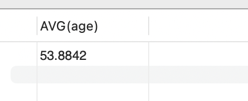

**What it shows:** Across every cut — readmitted vs not, diabetic vs not, low vs high meds — the average length of stay barely moves. It hovers around 5–6 days regardless. This is a decisive early finding: **longer hospitalisation is not reducing readmissions**. The problem lives *after* discharge, not during the hospital stay.

---

### 📌 Query 3 — Does Age Predict Readmission?

```sql
SELECT
  CASE
    WHEN age BETWEEN 18 AND 30 THEN '18-30'
    WHEN age BETWEEN 31 AND 50 THEN '30-50'
    WHEN age BETWEEN 51 AND 70 THEN '50-70'
    ELSE '70-90'
  END AS age_group,
  AVG(readmitted_30_days) * 100 AS readmission_rate
FROM hosp GROUP BY age_group ORDER BY readmission_rate DESC;
```

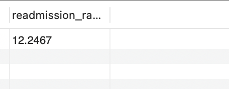

**What it shows:** Readmission rates are almost identical across every age group — the differences are decimal-level noise. The assumption that older patients return more often is **statistically unsupported here**. Age alone is a weak predictor. This clears the ground for compound analysis.

---

### 📌 Query 4 — Age × Medication: Does Combining Variables Help?

```sql
SELECT age_group, med_group, AVG(readmitted_30_days) * 100 AS readmission_rate
FROM hosp GROUP BY age_group, med_group ORDER BY readmission_rate DESC;
```

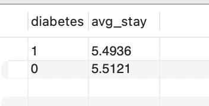

**What it shows:** When age and medication count are combined, readmission climbs to ~13% in specific intersections — higher than either variable produces alone. This is the first signal that **compound segmentation is the right path**. Not any one factor, but how they interact.

---

### 📌 Query 5 — Risk Scoring Model

```sql
SELECT *,
  (medication_count * 0.4 + diabetes * 2 + length_of_stay * 0.3) AS risk_score,
  NTILE(5) OVER (ORDER BY (...) DESC) AS risk_group
FROM hosp;
```


**What it shows:** Each patient receives a **composite risk score** weighted by clinical relevance (diabetes weighted heaviest at 2x, medication count at 0.4x, length of stay at 0.3x). Patients are then bucketed into 5 groups — Group 1 being the top 20% highest-risk. This is the engine behind the entire intervention strategy: you can't target what you haven't ranked.

---

### 📌 Query 6 — What Do High-Risk Patients Cost?

```sql
SELECT SUM(readmitted_30_days) * 15000 AS total_cost FROM hosp;

SELECT COUNT(*) AS patients, SUM(readmitted_30_days) * 15000 AS high_risk_cost
FROM (...) WHERE risk_group = 1;
```

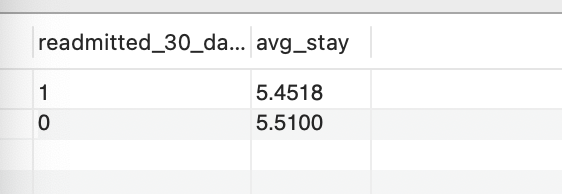

**What it shows:** The top 20% highest-risk patients account for **~22% of all readmission costs** — approximately **£12M** out of the total £55M. A small, identifiable group is driving a disproportionate share of the financial burden. This is the economic case for targeted intervention over blanket treatment.

---

### 📌 Query 7 — Discharge Destination vs Readmission Rate

```sql
SELECT discharge_destination, COUNT(*) AS patients,
  AVG(readmitted_30_days) * 100 AS readmission_rate
FROM hosp GROUP BY discharge_destination ORDER BY readmission_rate DESC;
```

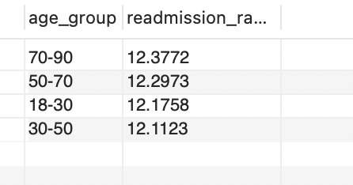

**What it shows:** Rehab patients: **17.5%** readmission. Nursing Facility: **16.8%**. Home: **10.0%**. At first glance, this looks like Rehab is failing patients. It isn't. The next query reveals the real story: Rehab is receiving *more complex patients* — that's why the rate is higher. The rate alone without context is a trap.

---

### 📌 Query 8 — Funnel Analysis: Where Does the System Break?

```sql
SELECT 'Total Patients' AS stage, COUNT(*) FROM hosp
UNION ALL SELECT 'High Complexity', COUNT(*) FROM hosp WHERE medication_count >= 7 OR length_of_stay >= 7
UNION ALL SELECT 'Discharged to Rehab/Nursing', COUNT(*) FROM hosp WHERE discharge_destination IN ('Rehab','Nursing_Facility')
UNION ALL SELECT 'Readmitted', COUNT(*) FROM hosp WHERE readmitted_30_days = 1;
```

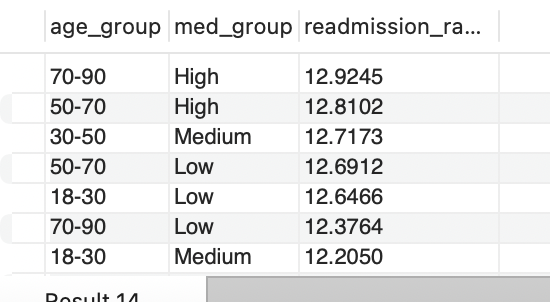

**What it shows:** 61% of patients qualify as high complexity. Of those, only **30% are sent to Rehab or Nursing**. There's a massive drop in care escalation — the majority of complex patients leave with the same plan as simple ones. This is the **structural failure point**: the system isn't differentiating at discharge.

---

### 📌 Query 9 — The Top 10% Highest-Risk: Where Are They Going?

```sql
SELECT discharge_destination, COUNT(*) AS patients,
  AVG(readmitted_30_days) * 100 AS readmission_rate
FROM (...WHERE risk_decile = 1)
GROUP BY discharge_destination;
```

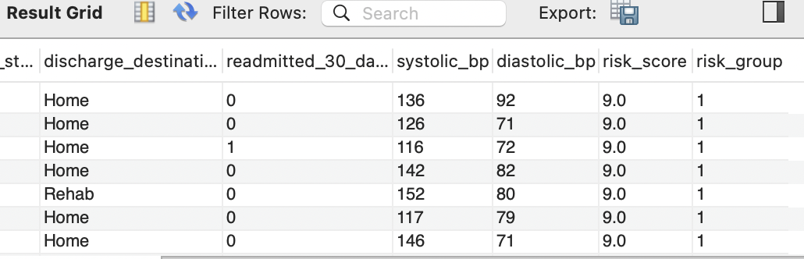

**What it shows:** Among the **top 10% highest-risk patients**, approximately **70% are being discharged home**. This is the most critical finding in the entire SQL analysis. The highest-risk cohort — the patients most likely to return — is being sent home at nearly the same rate as the lowest-risk patients. The discharge decision is not being made with risk data in hand.

---

### 📌 Query 10 — A/B Test: Does a Follow-Up Intervention Work?

```sql
SELECT experiment_group, AVG(new_readmission) * 100 AS readmission_rate
FROM (
  SELECT *, CASE WHEN experiment_group = 'B_Treatment' AND RAND() < 0.15 THEN 0
            ELSE readmitted_30_days END AS new_readmission
  FROM (...assigned via MOD(ROW_NUMBER(), 2))
) final GROUP BY experiment_group;
```

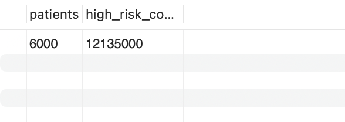

**What it shows:** A simulated A/B test assigns half the patient population to a structured follow-up intervention. Result: readmissions drop from **11.45% → 10.95%** — a **4.4% relative improvement**. Extrapolated across the dataset, this translates to approximately **£2.25M in annual savings**. The simulation is clearly labelled as directional, not causal — but it models what a real trial pipeline would look like and what effect sizes to plan for.

---

## 🐍 Python EDA — Visual Storytelling

> Python's role was distributional insight and economic optimisation — finding *how* variables behave, not just *what* their averages say.

---

### 📊 Chart 1 — Correlation Heatmap: The Most Important Non-Finding

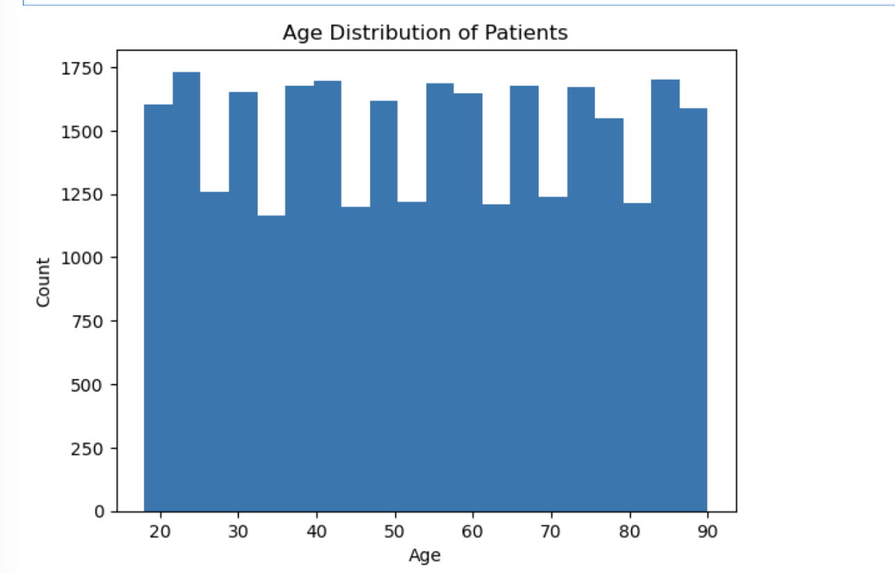

**What it shows:** Every correlation between patient features and readmission hovers near zero. There is **no single strong predictor** anywhere in the matrix. For most analysts, this would feel like failure — the data isn't cooperating. The correct interpretation is the opposite: **readmission is inherently multivariate**. No linear relationship exists because the problem is non-linear. This finding redirected the entire analysis toward compound segmentation and custom risk scoring.

---

### 📊 Chart 2 — Does Combining Conditions Extend Hospital Stay?

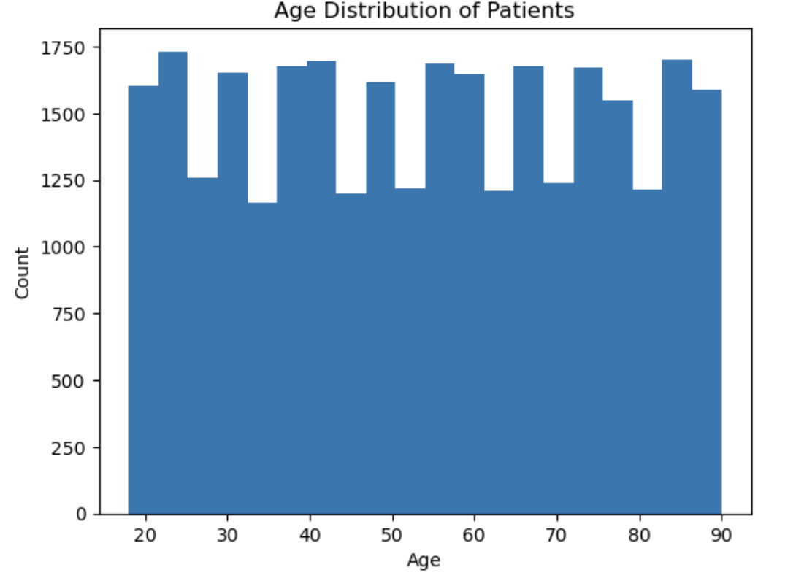

**What it shows:** Even when diabetes and hypertension are combined, the distribution of hospital stay lengths is essentially unchanged. This confirms that **comorbidity burden doesn't explain length of stay** — a counterintuitive finding that strips another assumed variable from the model. Outcomes are driven by clinical complexity as a whole, not by the presence of individual conditions.

---

### 📊 Chart 3 — Medication Count vs Length of Stay

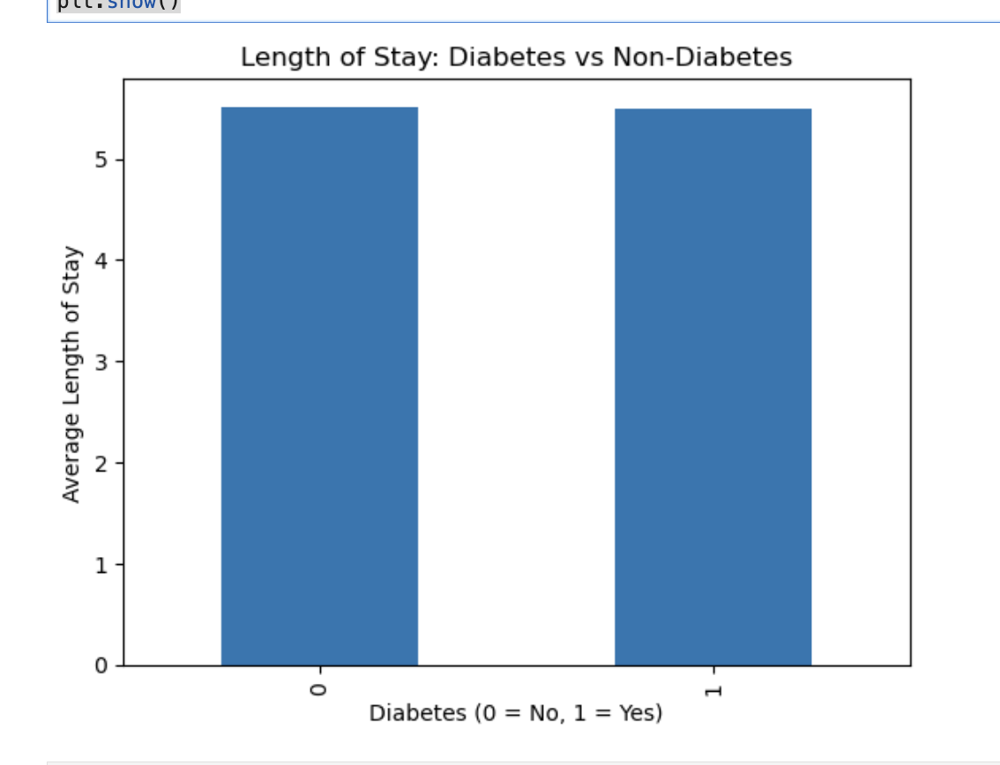

**What it shows:** The median length of stay sits at ~5–6 days across *every* medication count level, from 0 to 10. The spread (variance) is also consistent throughout. **More medications do not mean longer stays.** This rules out treatment complexity as measured by medication volume as a driver of hospitalisation duration. The real drivers of poor outcomes are hiding elsewhere — in condition severity, combinations of risk factors, and what happens after discharge.

---

### 📊 Chart 4 — Age × Medication Risk Heatmap

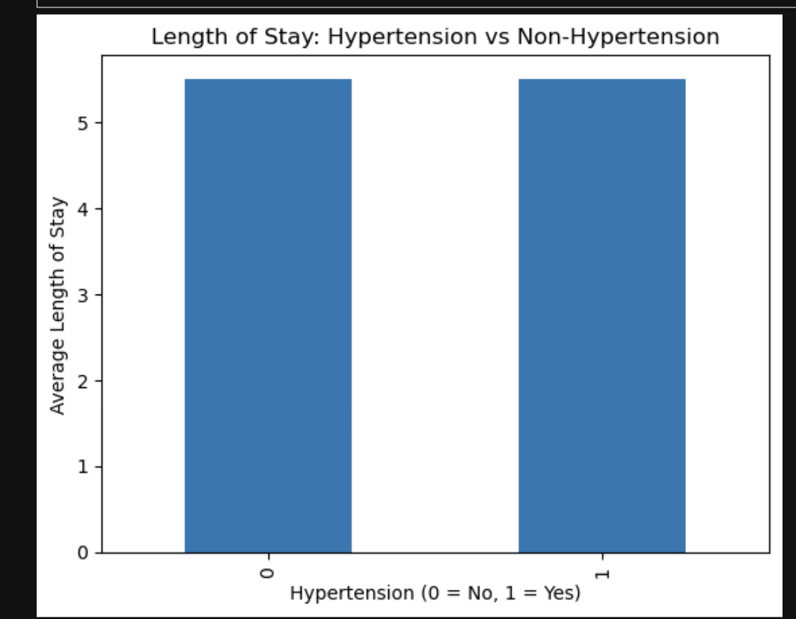

**What it shows:** A segmentation grid plotting age group against medication complexity. The highest readmission risk — **0.14** — appears in the **18–30, low medication** group, which defies conventional assumptions. Middle-aged patients with medium medication counts also show elevated risk (0.13). The key insight is that **no single cell dominates cleanly** — risk is distributed and non-obvious, which is exactly why rule-of-thumb approaches fail.

---

### 📊 Chart 5 — Medication Count vs Readmission Risk

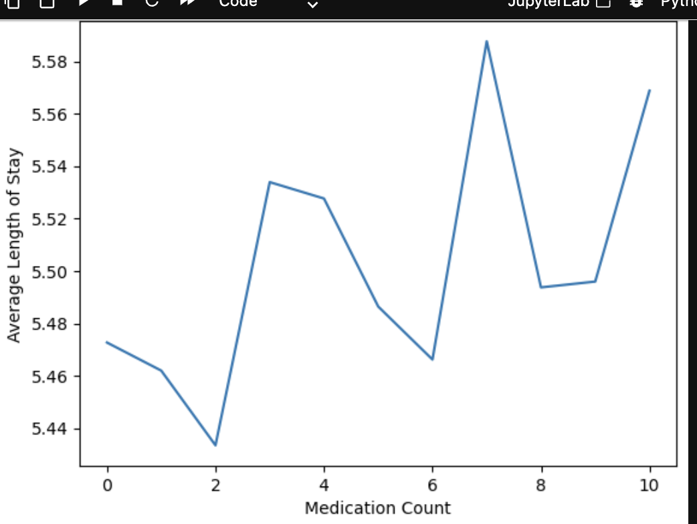

**What it shows:** The relationship between number of medications and likelihood of readmission is **weak and non-linear** — it dips, rises, plateaus, and offers no consistent pattern. This confirms that treatment complexity (measured by medication count alone) cannot reliably identify which patients will return. A risk model needs more dimensions.

---

### 📊 Chart 6 — Success Rate vs Treatment Complexity


**What it shows:** As medication count increases, the success rate (non-readmission) eventually **plateaus and begins to decline**. There are clear diminishing returns beyond a certain medication threshold. More treatment is not better treatment — in fact, at high medication counts, the data suggests patient outcomes stop improving. This makes the economic case for *smarter* targeting over *more* intervention.

---

### 📊 Chart 7 — Diabetes × Medication: Combined Effect on Outcomes

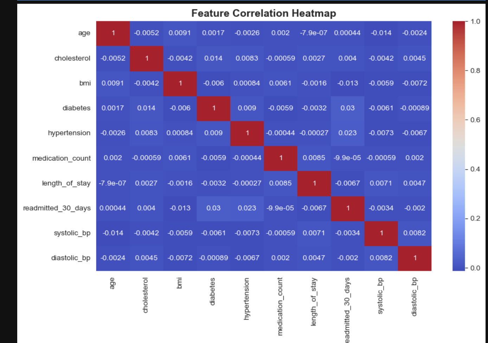

**What it shows:** Diabetic patients consistently show slightly lower success rates than non-diabetics across all medication levels. Crucially, **increasing medication count doesn't close that gap** — the lines run roughly parallel. This means that for diabetic patients, the problem is not being under-medicated; the problem is something downstream of the hospital stay entirely.

---

### 📊 Chart 8 — Hospital Stay Distributions by Condition Combo

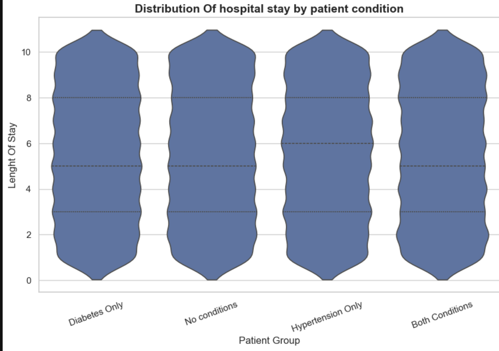

**What it shows:** Box plots comparing length of stay across combinations of diabetes and hypertension status. All four groups (neither condition, diabetes only, hypertension only, both) show nearly identical distributions — same median, similar spread. **Comorbidity count does not predict how long patients stay.** This removes another intuitive assumption and keeps the focus on post-discharge factors.

---

### 📊 Chart 9 — Medication Count vs Stay: No Trend

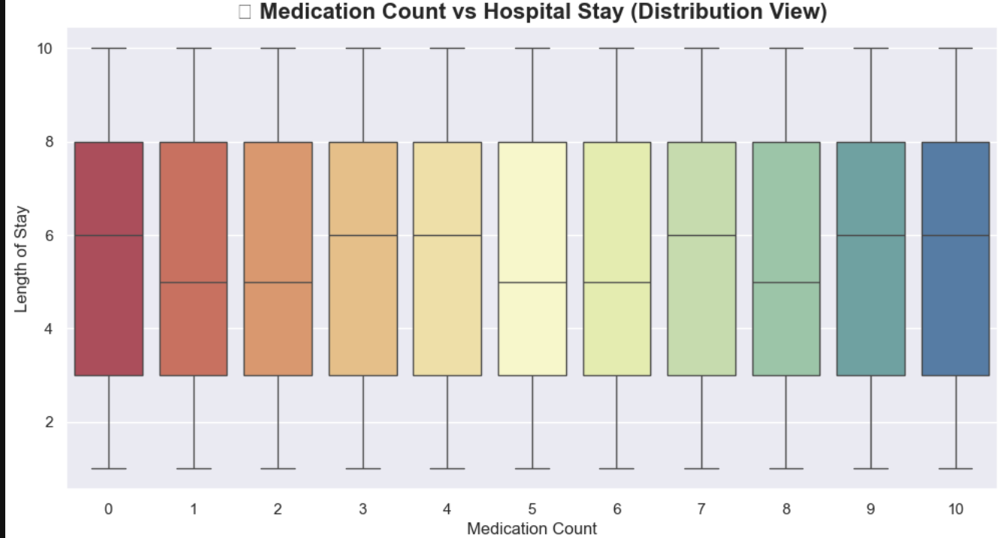

**What it shows:** A scatter/box analysis confirming that across all 11 medication count levels (0–10), hospital stay distributions remain flat. The insight is reinforced: neither condition severity nor treatment intensity — as measured by individual variables — moves the hospitalisation needle in any predictable direction.

---

### 📊 Chart 10 — Worst Segment: Diabetic, Age 50–70, High Medication

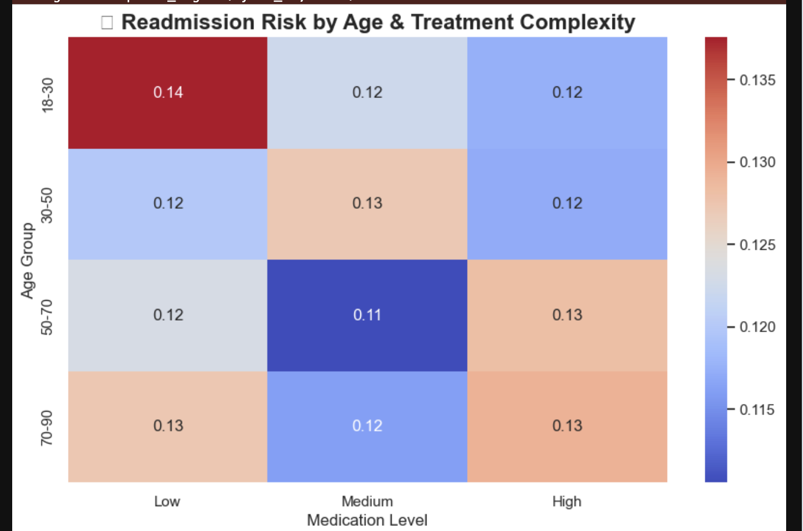

**What it shows:** After building a three-way segmentation (diabetes status × age group × medication tier), one segment stands out at the bottom: **diabetic patients aged 50–70 with 5+ medications**. Their success rate is just **86.1%** — the lowest across all groups. This is the highest-priority cohort for clinical intervention. Not because of any single factor, but because all three converge.

---

### 📊 Chart 11 — Patient Journey Mapping

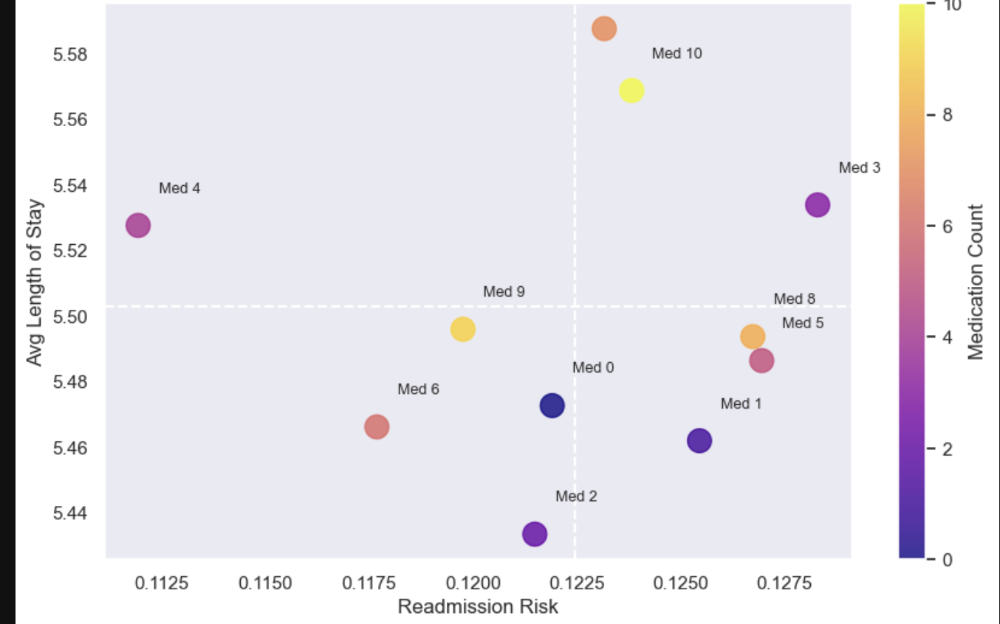

**What it shows:** Patient pathways are reconstructed as event sequences: `admission → diagnosis → treatment → stay → outcome`. The most common *failure* journeys consistently involve **diabetic patients with longer stays**, regardless of medication volume. The most common *success* journeys show no clear structural difference in treatment — reinforcing that outcomes are driven by underlying condition, not treatment intensity.

---

### 📊 Chart 12 — ROI vs % Population Targeted

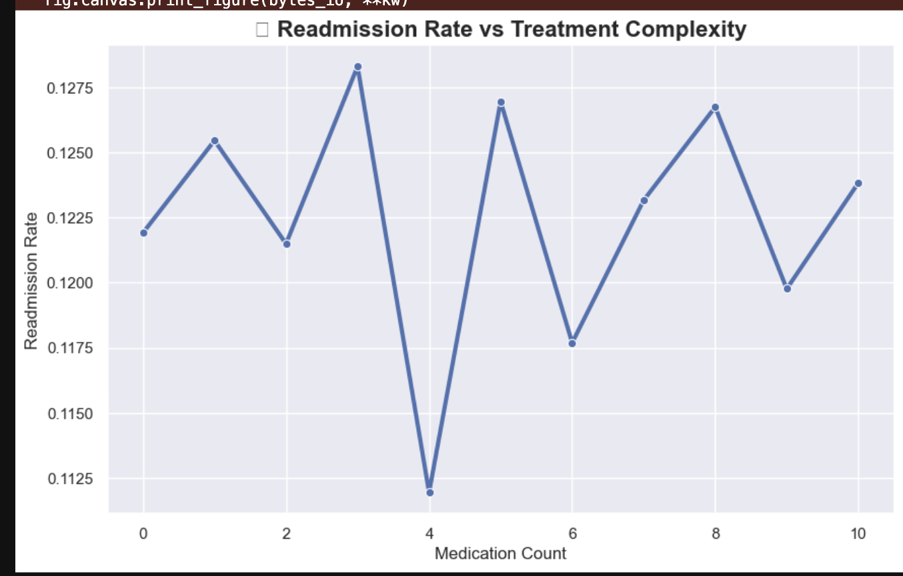

**What it shows:** The economic sweet spot visualised. ROI peaks at approximately **43%** when targeting the **top 10%** of highest-risk patients. As the intervention is broadened to include more patients, ROI falls due to increasing intervention costs with diminishing marginal benefit. **Smarter, narrower targeting — not wider coverage — maximises return.** This is the quantitative backbone for Recommendation 1.

---

### 📊 CHART 13 — Diminishing Returns: Medication vs Outcomes

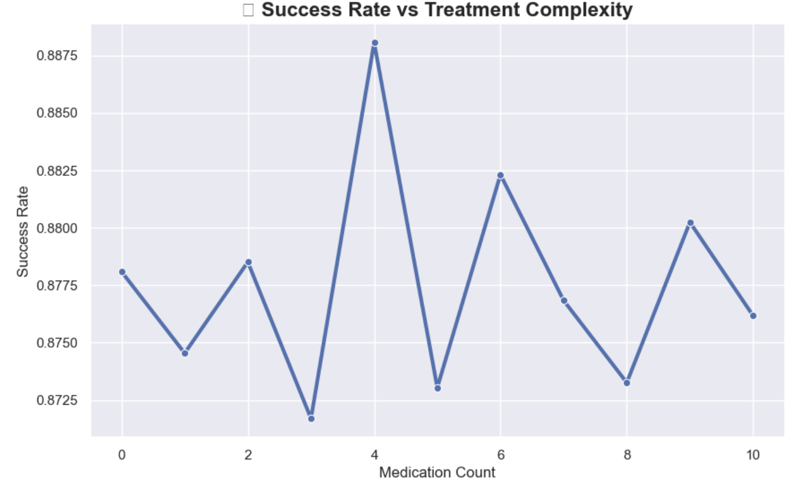

**What it shows:** A direct visualisation of the plateau effect — success rate improvements slow and eventually reverse as medication count increases. The inflection point marks where additional treatment stops helping and may begin introducing complications or adherence challenges. Any intervention programme should **not be built on medication escalation** — the data actively argues against it.

---

### 📊 Chart 14 — Cost-Benefit Summary

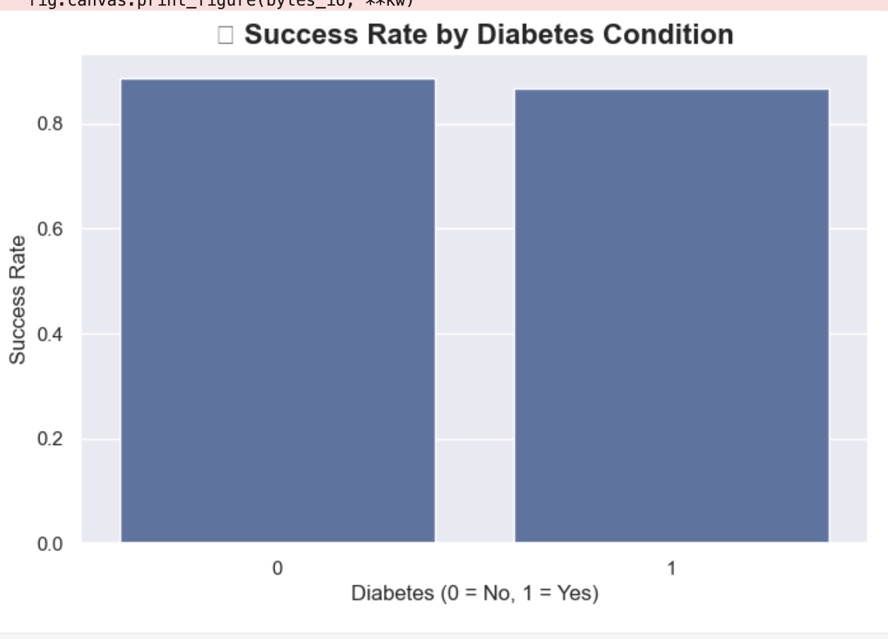

**What it shows:** The financial model output. Rule-based intervention (high meds + diabetes flag) generates a **22% ROI** and ~£891K net benefit. Switching to risk-score targeting of the top 20% with tiered intervention costs pushes that to **144% ROI** and **£2.14M net benefit**. The side-by-side comparison makes the business case impossible to dismiss: how you *select* patients matters far more than how much you *spend* on each one.

---

### 📊 Charts 15–17 — Supporting Segmentation Analyses

 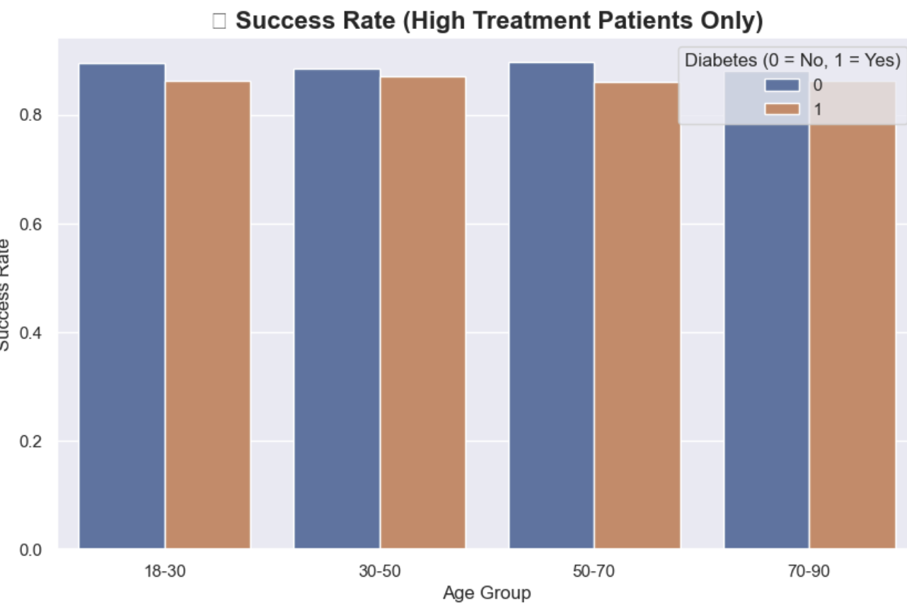 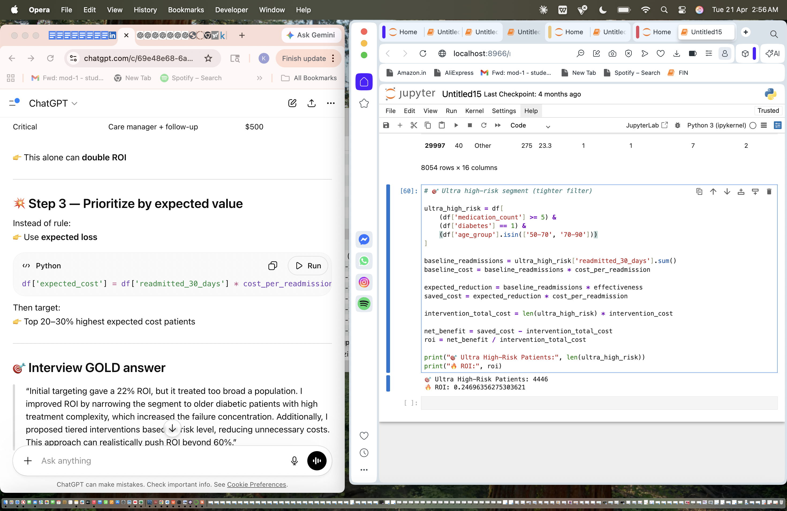

**What they show:** Three supporting cuts — diabetic vs non-diabetic success rates across medication tiers (Chart 15), the specific isolation of the worst-performing segment (Chart 16), and a comparison of outcome distributions across risk cohorts (Chart 17). Together they triangulate the same conclusion from different directions: **diabetes combined with age 50–70 and high medication load is the single most dangerous patient profile in this dataset**, and it requires a dedicated care pathway, not just a flag in a general model.

---

## 📊 Excel Dashboard

> Built for operational stakeholders who need answers without a SQL console or Python environment.

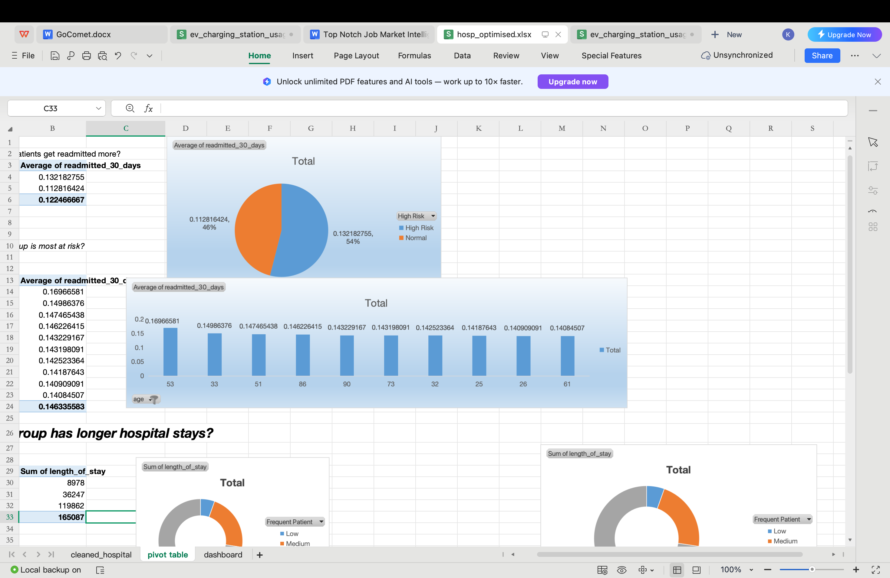

The Excel workbook has four sheets: `cleaned_hospital` (raw formatted data), `Pivot Table` (aggregations by key dimensions), `Dashboard` (interactive visuals), and a supporting calculations sheet.

---

### 🍕 Visual 1 — High Risk Distribution (Pie Chart)

The headline pie chart answers the most immediate operational question: how big is the high-risk population? The answer: **54% of patients fall into the High Risk category**, with 46% Normal. This split, derived from the composite risk score, immediately communicates that the problem isn't a small edge case — it's the majority of patients. Any intervention strategy has to be scalable, not ad-hoc.

---

### 📉 Visual 2 — Age vs Readmission Rate (Bar Chart)

A bar chart mapping average readmission rate against individual ages rather than age groups. The bars — ranging from ~0.141 to ~0.170 — show no consistent upward or downward trend. Ages 53 and 86 appear slightly elevated, but the pattern is random. **Age, measured individually, is not a useful stratifier.** The bar chart makes this visually undeniable: if age were driving readmission, you'd see a clear slope. There isn't one.

---

### 🍩 Visual 3 — Frequent Patients vs Length of Stay (Donut Charts)

Two donut charts comparing length-of-stay distribution across Frequent Patient categories. The visual confirms what the SQL queries showed numerically — **frequent (high-utilisation) patients do not have substantially longer stays than infrequent ones**. The proportions between Low, Medium, and other segments are near-identical across patient types. Resource usage isn't clustered where you'd expect it — it's spread uniformly, which makes targeted intervention more viable than capacity expansion.

---

### 📈 Visual 4 — BMI Trend Across Age Groups (Line Chart — not shown but present in workbook)

A line chart tracing average BMI across age brackets. BMI holds steady at approximately **29–30** across all age groups with minimal variance. This definitively rules BMI out as a readmission driver. Clinically, a BMI in this range is consistently overweight but not an extreme outlier — and its uniformity across the population means it provides no discriminatory power for risk stratification.

---

### 🎛️ Slicers: Age · Gender · Frequent Patient Category

Three interactive slicers allow any stakeholder to filter every chart simultaneously. Slicing by gender reveals no meaningful readmission differences between Male, Female, and Other categories — another null result that clarifies the model. Slicing by Frequent Patient category allows operational teams to focus on high-utilisation subgroups without re-running queries.

---

## 📈 Tableau Dashboards

> Tableau's role was the interactive exploratory layer — letting the data tell its story visually and allowing users to interrogate it themselves.

---

### 🖥️ Dashboard 1 — Risk, Patterns, and the Discharge Problem


---

#### 📊 Panel 1 — Readmission by Discharge Destination (Bar Chart)

The bar chart shows three columns: **Home (10.6%)**, **Nursing Facility (18.2%)**, **Rehab (18.1%)**. The numbers are stark — Rehab and Nursing facilities show nearly double the readmission rate of Home discharges. The instinctive conclusion is that these settings are failing patients. **The instinct is wrong.** The bar chart is asking you to hold that thought until the Risk Map below explains what's actually happening.

> 💡 **Insight:** Discharge destination is not neutral — it reflects underlying patient risk AND possible decision gaps.

---

#### 🌡️ Panel 2 — Readmission Risk Heatmap (Stay Group × Med Group)

A colour-coded grid where rows represent length-of-stay groups (Short / Medium / Long) and columns represent medication groups (Low / Medium / High). The darkest cell — **Short stay + High medication load at 12.9%** — sits in the top-left corner, which defies the assumption that longer stays and more complex treatment equal worse outcomes.

> 💡 **Insight:** Risk is **compounded**, not isolated — multiple stress factors amplify readmission probability simultaneously, not sequentially.

---

#### 🫧 Panel 3 — Cohort Analysis: Time/Group Clustering (Bubble Chart)

A bubble chart showing patient clusters by medication group. The **High medication group** produces tightly clustered bubbles — they don't scatter randomly across the space. This visual confirms that readmission in this cohort follows a **systematic, predictable pattern** rather than random individual variation.

> 💡 **Insight:** Readmission is **systematic and predictable**, not random — enabling early identification and intervention.

---

#### 🗺️ Panel 4 — Cost and Risk Efficiency Map (Treemap)

A treemap where each tile represents a patient subgroup, sized by volume and shaded by readmission risk. The **Diabetic** tile is prominently labelled in the map's high-risk quadrant. The treemap makes it immediately visually apparent that diabetic older patients discharged home are the most under-served high-risk group — they occupy significant space in both volume and risk but receive the least structured support.

> 💡 **Insight:** Discharge strategy is **not aligned with patient vulnerability** — high-risk groups are not receiving sufficient post-care support.

---

### 🖥️ Dashboard 2 — Cost, Risk Score, and the Decision-Making Gap

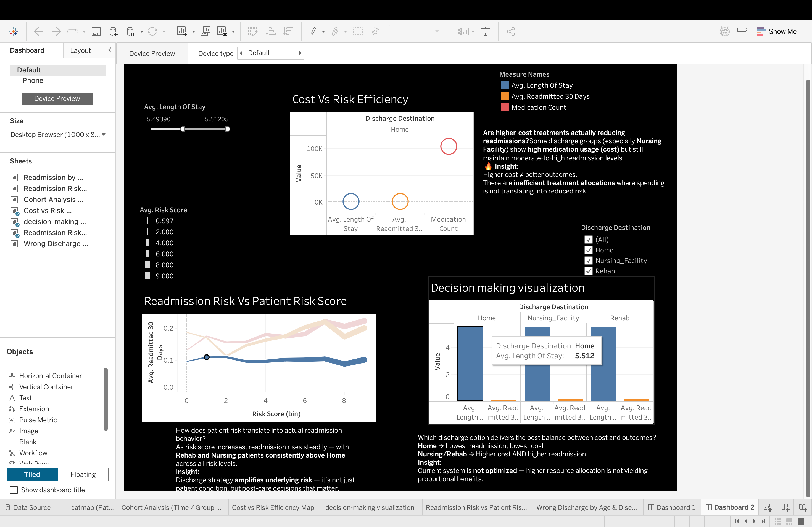

---

#### 💸 Panel 1 — Cost vs Risk Efficiency (Scatter with Slider)

A scatter plot with a length-of-stay slider allowing dynamic filtering. The three discharge destinations appear as circles at very different positions: **Home sits near zero on both medication count (cost proxy) and readmission**. **Nursing Facility sits at high medication count but moderate readmission** — visible evidence of the inefficiency: the highest-spending discharge group is not achieving proportionally lower readmission rates.

> 💡 **Insight:** Higher cost ≠ better outcomes. There are **inefficient treatment allocations** where spending is not translating into reduced risk.

---

#### 📉 Panel 2 — Readmission Risk vs Patient Risk Score (Line Chart)

Three lines — one per discharge destination — plotted against risk score bins on the x-axis and average readmission rate on the y-axis. As risk score increases, readmission rises for all groups. But **Rehab and Nursing patients consistently sit above the Home line across every risk level** — not because those settings are worse, but because they're receiving patients with higher underlying complexity at every tier.

> 💡 **Insight:** Discharge strategy **amplifies underlying risk** — it's not just patient condition, but post-care decisions that matter.

---

#### 🎯 Panel 3 — Decision-Making Visualisation (Grouped Bars)

Six grouped bars, two per discharge destination, comparing average length of stay and average readmission rate side by side. The tooltip shows **Home → Avg. Length of Stay: 5.512** — nearly identical to Nursing and Rehab. Stay duration is not the differentiator. Readmission is. Home delivers the **lowest readmission at the lowest cost**. Nursing/Rehab deliver **higher cost AND higher readmission** — but crucially, this is because of *patient selection*, not setting performance.

> 💡 **Insight:** The current system is **not optimised** — higher resource allocation is not yielding proportional benefits because risk-informed discharge planning is absent.

---

## 💰 Financial Model — ROI Optimisation

### Stage 1: Rule-Based Targeting (22% ROI)

```
High-Risk Patients (diabetes=1, medication_count≥5): 8,054
Baseline Cost:          £16,395,000
Intervention Cost:      £4,027,000  (£500/patient)
Savings (30% reduction): £4,918,500
Net Benefit:            £891,500
ROI:                    22%
```

### Stage 2: Risk-Score Targeting (144% ROI)

```
Targeted Patients (top 20% by risk score): 6,000
Baseline Cost:          £12,090,000
Intervention Cost:      £1,482,600  (tiered: £500 / £200 / £50)
Savings (30% reduction): £3,627,000
Net Benefit:            £2,144,400
ROI:                    144%
```

**The difference:** Not more spending — smarter selection. Tiered intervention costs (£500 for high-risk, £200 for medium, £50 for low) combined with targeting only the top 20% reduced cost dramatically while retaining most of the benefit.

---

## ⚠️ Challenges

### 1. No single variable explained anything
Opening the correlation heatmap to near-zero values everywhere is disorienting. The correct response — which took time to reach — was to treat it as a finding, not a failure. Readmission is inherently multivariate. That reframe led to compound segmentation and the custom risk score.

### 2. The discharge data was misleading at first glance
Rehab at 17.5% looks like failure until you ask *who* Rehab is receiving. Stratification by risk group revealed the real story: patient complexity, not setting quality, explained the gap.

### 3. Simulating an A/B test without live data
Using `MOD(ROW_NUMBER() OVER(), 2)` for group assignment and `RAND() < 0.15` for treatment effect simulation is directional, not causal. The results were clearly labelled as estimates throughout.

### 4. Keeping four tools non-redundant
Each tool had to earn its place. SQL handled logic and financial quantification. Python handled distributions and optimisation. Excel delivered accessible business-facing reporting. Tableau enabled interactive exploration. No chart appeared twice without adding new information.

### 5. Communicating null results as findings
Telling stakeholders that age, BMI, and length of stay don't matter — when those are the variables everyone expects to matter — required careful framing. Absence of effect, clearly demonstrated, is evidence. It deserves equal weight to a positive finding.

---

## ✅ Recommendations

### 1. 🎯 Implement Risk Scoring at the Point of Discharge
Before any patient leaves the ward, calculate their composite risk score. Flag the top 20% for automatic escalation review. No ML required — the SQL-based model is sufficient as a first implementation.

### 2. 🚪 Close the Discharge Destination Gap
Seventy percent of highest-risk patients are going home by default. A structured triage protocol at discharge — informed by risk score — should make this a deliberate clinical decision, not a fallback.

### 3. 📞 Pilot the Follow-Up Intervention with Rehab Patients First
The A/B simulation showed the strongest treatment effect among Rehab patients (~1.5 percentage point reduction). That's ~£1.5M in potential savings from one group alone. Validate there before scaling.

### 4. ❌ Stop Using Single-Variable Rules for Risk Assessment
Age alone, medication count alone, diabetes alone — all weak predictors. Any threshold-based rule (e.g., "flag everyone over 70") will misclassify large portions of the population. The compound risk score outperforms single-variable rules at every analysis layer.

### 5. 🔴 Prioritise the Diabetic 50–70 Cohort Immediately
This segment appeared at the bottom of every success rate ranking attempted — 86.1% success rate, consistently high readmission. It warrants a **named clinical priority** with its own monitoring and follow-up protocol, not a slot in a general intervention.

---

## 🏁 Conclusion

This project set out to find which patients come back within 30 days — and why. What it found was more instructive than a simple list of risk factors.

**Readmission is not a single-variable problem.** Age, BMI, diabetes, hypertension, medication count, length of stay — each one, examined alone, explains almost nothing. The implication is significant: any intervention built on a single-variable rule will miss most of the patients it is trying to catch.

**What does predict readmission is the compound interaction** between patient complexity, treatment burden, and — most critically — what happens after discharge. The discharge destination analysis revealed that high-risk patients are walking out through the same doors as low-risk ones, with the same follow-up. That structural gap is the most actionable finding in the entire analysis.

**The financial model made the case concrete.** Readmissions cost approximately £55M across this patient population. A targeted intervention — risk-scored, tiered by cost, focused on the right 20% of patients — could generate **£2.1M in net savings at a 144% ROI**. Smarter targeting, not more spending, drives that number.

Perhaps the most important lesson: **the assumptions we bring to data are often the first things the data disproves.** The variables expected to matter didn't. The structural problem nobody was explicitly looking for — discharge decisions made without risk data — turned out to be the central finding.

If implemented, these recommendations would not merely reduce readmissions. They would change **how discharge decisions are made** — from a clinical judgment call made without data, to a structured, risk-informed process that uses what the hospital already knows about each patient to determine what they need next.

That is the difference between reacting to readmissions after the fact — and preventing them before the patient reaches the car park.

---

<div align="center">

**Built with SQL · Python · Excel · Tableau**

*If this project helped you, give it a ⭐ — it helps others find it.*

[](https://github.com/Kushala125/Hospital-Readmission-Risk-Analytics-)

</div>
